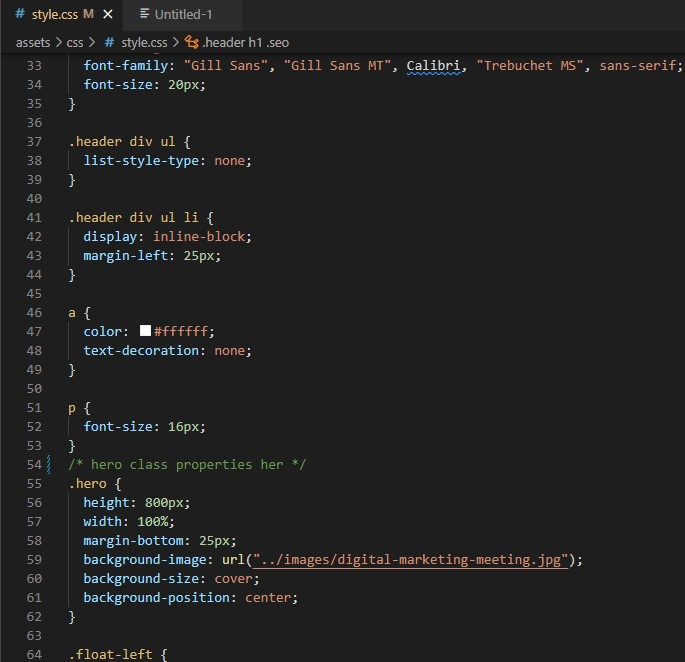

# marketing_agency_refactor

Refactor a marketing agency to use semantic html

# Technologies

-github
-git
-html
-css
-snipping tool (for screenshots)

# index.html before refactor(screenshots)

# index.html after refactor (screenshots)

# style.css before refactor (screenshots)

# style.css after refactor (screenshots)

# Website before refactor (screenshots)

# Website after refactor (screenshots)

# About me

Well, I am a Bootcamp student, soon to be software developer. This is my first website refactor using semantic html.
